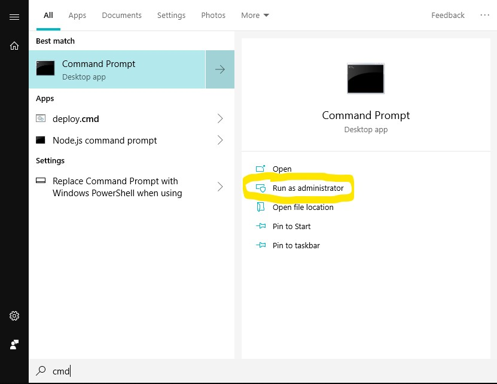
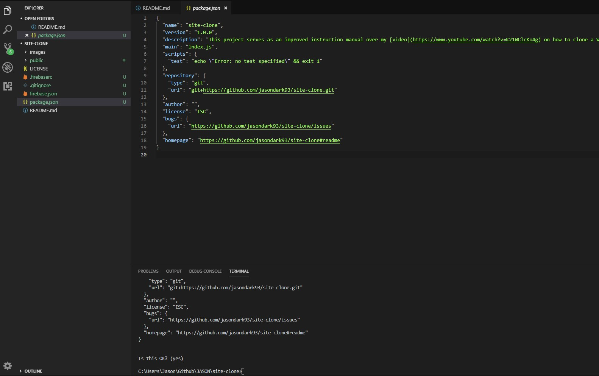

# Site Clone
These instructions provide supplimenatary information to my [video](https://www.youtube.com/watch?v=K21WClcKo4g) on how to clone a Website and host it with Firebase Hosting. Please watch this video in full for context before proceeding with the instructions below.


## Differences between these instructions and my video
- These instructions cater to Windows, Mac, and Linux rather than Linux / MacOS systems alone.
- Here we use a NPM deployment script which is operating system agnositc, rather than a bash script (like in my video).


### Step 1: Watch the [video](https://www.youtube.com/watch?v=K21WClcKo4g) in full
This is important for context. Don't jump straight into following the instructions below as these are written assuming that you have watched the video. In particular, these instructions don't cover Firebase Hosting or how to set up Firebase projects. These assume knowledge that you will gain from watching the video.


### Step 2: Install dependencies


#### Windows instructions

1. Open up a command prompt as administrator


2. Install Chocolatey package manager by entering:

```
@"%SystemRoot%\System32\WindowsPowerShell\v1.0\powershell.exe" -NoProfile -InputFormat None -ExecutionPolicy Bypass -Command "iex ((New-Object System.Net.WebClient).DownloadString('https://chocolatey.org/install.ps1'))" && SET "PATH=%PATH%;%ALLUSERSPROFILE%\chocolatey\bin"
```

3. In the same command prompt window, use Chocolatey to install Wget:

```
choco install wget
```

4. [Install Visual Studio Code](https://code.visualstudio.com/download)

5. [Install Node.js (installs NPM at the same time)](https://nodejs.org/en/download/)

#### Mac instructions

1. Open up a terminal.

2. Install Homebrew package manager by entering:

```
/usr/bin/ruby -e "$(curl -fsSL https://raw.githubusercontent.com/Homebrew/install/master/install)"
```

3. In the same terminal window, use Homebrew to install Wget:

```
brew install wget
```

4. [Install Visual Studio Code.](https://code.visualstudio.com/download)

5. [Install Node.js (installs NPM at the same time).](https://nodejs.org/en/download/)


#### Ubuntu instructions

1. Open up a terminal.

2. Enter:
```
sudo apt-get install wget
```

3. [Install Visual Studio Code.](https://code.visualstudio.com/download)

4. [Install Node.js (installs NPM at the same time).](https://nodejs.org/en/download/)


### Step 3: Add the NPM deploy script

1. Open up your Firebase project in Visual Studio Code.

2. Open up the integrated command prompt / terminal by pressing `ctrl + backtick` on your keyboard. You can also open this up from the top menu bar by going to `terminal > new terminal`.

3. In the terminal, type `npm init`. You can accept all the default in the interactive prompt, or enter details to suit your project.

4. This should create a file named `package.json`.


5. Within the command prompt / terminal, type `npm install`.

6. Close the command prompt / terminal that is open, then open a new one.

7. Make sure you are logged into Firebase by typing `firebase login`. 

8. Within `package.json`, go to the script section and remove the test script if present. We will add a new key value pair with a name and command, so it will look like this:
```
  "scripts": {
    "deploy": "cd public && wget https://yoursite.com --recursive --page-requisites --html-extension --convert-links -xnH -e robots=off && firebase deploy"
  },
```

9. Be sure to change out `https://yoursite.com` for your actual site, then save `package.json`.

10. Save `package.json`, then go back to your command prompt / termninal and enter `npm run deploy`.

### Step 4: Run the deployment script
1. Go to your command prompt / termninal and enter `npm run deploy`.

2. Once this has finished running, inspect the contents of your `public` folder. Each page from your site should be present here.

3. Go to the Firebase URL for your project and check that all is in order.


### FAQs

> My public folder contains most of the pages of my site, but it's missing some like the 404 page. Why is this?

The Wget script that runs goes to the url you enter (generally the home page of your site) and clones this page. From here, Wget gets any links to any other pages that it can see. Wget then goes to these pages and clones them. It gets any new links on these pages, then goes to these, and so on so forth (aka recursion). This means that Wget very likely clones all the pages in your site - unless there are no links to certain pages in your site. This is often the case for your 404 page. To get around this, all you need to to is make sure that somewhere on a page on your site there is a link to the 404 page. It does not matter if the link is hidden, but it just needs to be on the page. You can use this technique for any other pages that are missing. 
